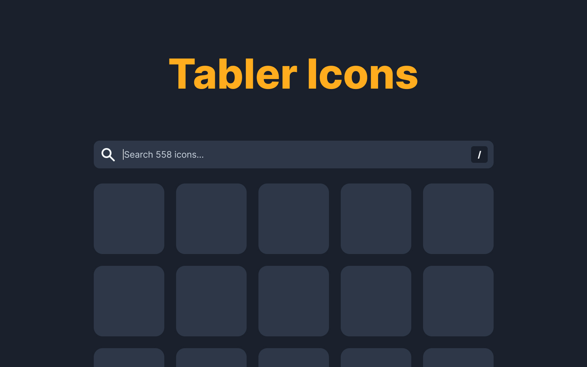

# A Tabler Icons viewer

🌎 https://icons.yiddishe-kop.com/ 
🌎 https://github.com/tabler/tabler-icons

**Planned features:**

- [x] Search
- [ ] Advanced search based on tags/concepts
- [x] Click to copy to the clipboard
- [x] Responsive
- [x] Dark mode
- [ ] Cypress-based e2e tests
- [ ] Buttons to download source/repos
- [ ] Toggle copy to clipboard OR download
- [x] Social tags/image
- [ ] Size options
- [ ] Colors options
- [ ] Remember the search query
	- [ ] E.g. https://feathericons.com/?query=layers
- [ ] Add tooltip UI to explain copy to clipboard
- [ ] Icon catagories
- [ ] Preview templates (like FontAwesome)
- [ ] Suggest an icon/features
- [ ] Create a Figma plugin
- [x] Add screenshots to the repo
- [ ] Vue-components version of click-copy
- [ ] Add offline support (PWA)

## Contributing

Have an idea for a nifty feature to make this tool better?

**Contributions are welcome!**

Also feel free to add ideas to the checklist above!

Built using the Vue CLI and Tailwind CSS, _of course_.

## License

Tabler Icons is licensed under the [MIT License](https://github.com/Yiddishe-Kop/tabler-icons-viewer/blob/master/LICENSE).
